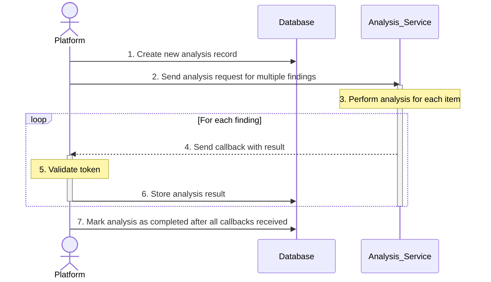

---
title:
  🤖 How Claude Code Transforms Development Workflows at a Seed-Stage Startup
date: "2025-06-09"
description: >
  Anthropic's new case study on Claude Code adoption sparked reflection on my
  own usage patterns at Pixee. Here's how AI-assisted development is changing
  the game for resource-constrained startups and the workflows it enables that
  weren't possible before.
---

Anthropic recently published a
[case study documenting how their internal teams use Claude Code](https://www-cdn.anthropic.com/58284b19e702b49db9302d5b6f135ad8871e7658.pdf).
Reading through their experiences, I was struck by how closely my own usage
patterns align with their findings—and where they diverge in interesting ways.

At Pixee, a seed-stage startup building AI-powered tools to automate Product
Security tasks for AppSec teams, Claude Code has fundamentally changed how I
approach software development. What started as Cursor FOMO has evolved into an
essential part of my daily workflow that enables entirely new approaches to
development challenges.

The timing couldn't be better for startups. When you're working with limited
engineering resources and need to move fast in competitive markets, AI coding
tools aren't just nice-to-have productivity boosters—they're strategic
advantages that can make the difference between shipping features quickly and
getting stuck in development bottlenecks.

## Why AI Tools Matter More at Seed Stage

At a seed-stage startup, you're constantly context-switching between unfamiliar
services and technology stacks while trying to prove product-market fit. For
small teams that can't expand headcount, Claude Code amplifies existing
productivity by providing instant context on any codebase.

## Diagram Generation: From 30 Minutes to 2 Minutes

One area where Claude Code has completely transformed my workflow is visual
documentation. I've entirely replaced draw.io with AI-generated
[Mermaid diagrams](https://mermaid.js.org). For simple diagrams, I typically use
Claude Desktop, but Claude Code is superior when the agent needs code context to
inform the diagram generation.

Previously, creating architecture diagrams meant 30 minutes in draw.io. Now I
describe the system and get professional Mermaid diagrams in 2 minutes. Claude
Code makes my prompts even shorter because it can gather the necessary code
context automatically—I don't need to explain implementation details that it can
discover by examining the codebase directly.



## Gap Analysis Without the Waiting

Customer requests often arrive with urgency. Recently, a customer asked if our
services can integrate with IAM roles for service accounts in AWS-based
Kubernetes deployments. This sometimes requires changes to how S3 clients are
configured.

Two capabilities made this transformative: **automated codebase auditing** and
**MCP-powered planning**. Claude Code systematically audited our S3 client
creation patterns across multiple repositories, identifying exactly where
changes would be needed. More importantly, it used the DevRev MCP server to
create properly scoped tickets with full technical context—turning its analysis
directly into actionable work items.

This MCP integration eliminates the typical handoff friction between analysis
and planning. What would have been days of manual investigation, Slack
coordination, and ticket creation was completed in hours, enabling immediate
customer responses.

## Cloud Resource Automation: No More Terminal Babysitting

I use Claude Code to create AWS resources for testing our deployment
configurations. Recently, I needed an EKS cluster, RDS cluster, S3 bucket, and
IAM roles with policies. Some resources required custom CloudFormation
resources.

Claude Code wrote the CloudFormation templates, deployed the stack, monitored
resource creation, and troubleshot deployment issues—all asynchronously while I
focused on other work. Instead of babysitting terminal sessions through the
tediously long feedback loops of cloud deployments, I can context-switch to
other tasks while the agent handles the waiting and debugging.

```text
‚è∫ Bash(helm install aws-load-balancer-controller eks/aws-load-balancer-controller \
        -n kube-system \…)
  ⎿  NAME: aws-load-balancer-controller
     LAST DEPLOYED: Mon Jun  9 12:02:56 2025
     NAMESPACE: kube-system
     STATUS: deployed
     … +4 lines (ctrl+r to expand)

‚è∫ Great! Now let me verify the controller is running:

‚è∫ Bash(kubectl get deployment -n kube-system aws-load-balancer-controller)
  ⎿  NAME                           READY   UP-TO-DATE   AVAILABLE   AGE
     aws-load-balancer-controller   0/2     2            0           9s

‚è∫ Bash(sleep 30 && kubectl get deployment -n kube-system aws-load-balancer-controller)
  ⎿  NAME                           READY   UP-TO-DATE   AVAILABLE   AGE
     aws-load-balancer-controller   2/2     2            2           44s

‚è∫ Perfect! Now let me create an updated values file for AWS native deployment. I'll configure it to use AWS Application Load Balancer (ALB) with proper
  annotations:
```

## Java Development Where VS Code Falls Short

While Cursor, Windsurf, and GitHub Copilot shine in VS Code, they struggle with
complex Java projects in IntelliJ. Claude Code bridges this gap perfectly—the
IntelliJ MCP server provides seamless IDE integration without tooling
compromises.

## Database Schema Management: Automated Migrations with Confidence

Database changes at a startup need to be both fast and safe. You're iterating on
schema designs based on customer feedback, but you can't afford data corruption
or migration failures in production. Claude Code's PostgreSQL MCP server
integration has transformed how we handle schema evolution.

Using the PostgreSQL MCP server, Claude Code gets complete context on our
database schema and writes Liquibase migrations with comprehensive tests. We
have tests for each migration, and Claude Code reviews existing migration
patterns to ensure consistency.

When I describe schema changes, Claude Code examines our existing schema,
identifies the optimal approach, writes the Liquibase changelog, and creates
tests that verify the migration works correctly with existing data.

```yaml
- changeSet:
    id: tag-database-v2.08
    author: claude
    comment: |
      Tag the database at version 2.08
    changes:
      - tagDatabase:
          tag: v2.08
```

_Note how Claude Code confidently lists itself as the author—it's not wrong._

## PR Workflow Acceleration: From Feedback to Implementation

Code review cycles at a startup need to be fast without sacrificing quality.
Claude Code has streamlined our PR workflow by handling reviewer feedback
implementation through GitHub's MCP integration.

When reviewers leave feedback, Claude Code reads the comments and applies the
suggested changes directly via the GitHub API. This eliminates the manual
back-and-forth that can slow down feature delivery. More importantly, Claude
Code often captures the intent behind feedback better than rushed manual
implementations.

I've even started letting Claude Code write my commit messages. Its messages are
often more descriptive and consistent than my hurried attempts during rapid
development cycles. Claude Code considers the full context of changes and crafts
messages that accurately reflect both the technical modifications and business
intent.

Having Claude Code handle commits is particularly valuable in repositories with
pre-commit hooks. While I personally dislike pre-commit hooks, I sometimes work
in repositories that have them. Claude Code reacts intelligently to failed
pre-commit hooks—when a commit fails due to formatting issues, it automatically
runs the appropriate fixes (like `ruff --fix`) and retries the commit
seamlessly.

This automation is especially valuable for distributed teams where code review
cycles can span multiple time zones. Changes can be implemented and re-reviewed
without waiting for the original author to come online.

## Enabling New Workflows

Claude Code doesn't just speed up existing workflows—it enables entirely new
approaches. I'm now comfortable diving into any codebase regardless of
familiarity. This democratization of expertise means any team member can
contribute across our entire stack without needing specialists in every
technology.

## The Competitive Advantage

For startups, AI coding tools aren't optional luxuries—they're competitive
necessities. Teams that leverage these tools effectively gain significant
advantages in development velocity and technical capability, enabling small
teams to compete against larger, better-resourced competitors.

## Conclusion

Claude Code has transformed how I approach software development at Pixee. What
started as experimentation with a new tool has evolved into fundamental workflow
changes that enable our small team to operate with the technical capability of a
much larger organization.

The most significant change isn't just increased productivity—it's increased
confidence. I no longer hesitate to tackle unfamiliar codebases or implement
features outside my core expertise. Claude Code provides the scaffolding needed
to work effectively across any technical domain.

For other startup developers considering Claude Code, I'd recommend starting
with one workflow that currently requires significant manual effort—whether
that's documentation generation, infrastructure management, or cross-codebase
analysis. The tool's value becomes apparent quickly, and the workflow
improvements compound as you discover new applications.

The future of software development is increasingly collaborative between human
developers and AI tools. Claude Code offers a glimpse of that future, and for
startup teams willing to embrace it, the competitive advantages are substantial.
