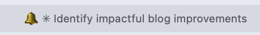
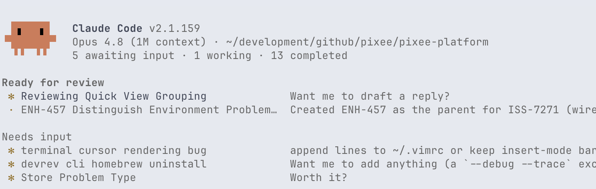

A while back, in [AI Coding Agents and the Primacy of Fast Feedback Loops](/blog/ai-agents-feedback-loops/), I described orchestrating multiple coding agents in parallel. The orchestration mechanics behind that post have changed. On <time datetime="2026-05-11">May 11th</time>, Anthropic shipped Claude Code's [agents view](https://code.claude.com/docs/en/agent-view) as a research preview (v2.1.139), and after a week of running on it I've retired the terminal tab tricks I used to depend on. This post describes what I changed to adopt this new feature into my workflow.

## The old way: a stack of Ghostty tabs

For a while my multi-agent setup was one Claude Code session per Ghostty tab, with [BEL-character](https://ghostty.org/docs/vt/control/bel) integration wired in so Claude could ring the terminal bell and Ghostty would flag the originating tab as needing attention.



I tried out the purpose-built multiplexer cmux for a couple of weeks somewhere in the middle, but I didn't love the experience, so I went back to Ghostty tabs.

<aside>
inb4 "why not tmux": I know about tmux, and no, I'm not using it. Mitchell Hashimoto explains well on [Fragmented #310](https://fragmentedpodcast.com/episodes/310/) how tmux can be an impediment to adopting richer terminal experiences. A multiplexer is a terminal inside a terminal, so any modern escape sequences the outer terminal supports but the multiplexer doesn't (like graphics, hyperlinks, and mouse support) get stripped in transit. I'd rather keep Ghostty's full feature surface than re-flatten it through tmux.
</aside>

The tabs setup works OK, but it has some rough edges:

1. The name of the tab is all the context I have on which agent is running in that tab. I typically set the names myself using Claude's `/rename` command, instead of relying on Claude's automatic naming. Still, there's not a lot of real estate in a tab name to describe what's happening.
2. Once I select the tab, the BEL clears regardless of whether or not I'm ready to spend the time reviewing the agent's work in that tab. There's no good way to keep an agent "on read" so that I can remember to come back to it.
3. More than 6 tabs gets unwieldy.
4. Restarting the machine hurts. All the tabs go away. I used to always update my OS as soon as a new update is available. I turned into the developer that pushes it off until the corporate MDM software forces you to update and restart.

## How the agents view smooths these out

I'm on one Ghostty tab now. The agents view lists every session grouped by state and shows me which ones are awaiting input. After I hand off a task, I flip back to the agents view and the agent that's ready for me is right there.



1. **Each agent gets a whole row.** Beyond the name, the agents view shows me the working directory, the agent's state, any associated PRs, and how long since the last message. That's the context a tab title never had room for.
2. **"Needs review" sticks.** An agent stays in the "needs review" state until I've actually followed up with it. Selecting it doesn't dismiss the signal the way clicking a tab cleared the BEL. Agents I'm not ready for stay flagged.
3. **A dozen agents fits comfortably.** I've kept more than 12 agents in the view without it feeling crowded. The lower navigation cost makes me more willing to leave old work around for context later.
4. **Sessions persist across restarts.** Claude Code remembers agents across both Claude Code restarts and OS updates. I stopped mourning my session management, and I'm back to applying OS updates as soon as they show up.

## Repository secrets friction

The one thing I didn't see coming was how the agents view changes the way per-repo secrets get loaded.

My old workflow leaned on shell startup. I use the oh-my-zsh dotenv plugin to load `<repo>/.env` whenever I `cd` into a repo. The plugin fires on `chpwd`, so by the time I launched `claude` the shell already had the repo's secrets in its environment:

1. Open a new Ghostty tab.
2. `cd` to the repository.
3. The dotenv plugin fires on `chpwd` and loads the gitignored `.env` into the shell.
4. Launch `claude`. The new process inherits the secrets, and the build works.

The agents view collapses steps 1 and 2. I launch `claude agents` once, from the parent directory that holds all my repos. New agents start in whatever subdirectory I pick from the view, but no shell ever `cd`'d into that directory, so `chpwd` never fired and `.env` never loaded. The agent would run; anything that needed a repo secret (typically the build) would fail.

The fix is a `SessionStart` hook that sources `$PWD/.env` into the agent's environment via Claude Code's `$CLAUDE_ENV_FILE`, which the session sources before any tool call:

```bash
#!/bin/bash
set -euo pipefail

# Only honor .env files inside one of these directories.
ALLOWLIST=(
  "$HOME/development/github/pixee"
  "$HOME/development/github/gilday"
)

[ -n "${CLAUDE_ENV_FILE:-}" ] || exit 0
[ -f "$PWD/.env" ] || exit 0

allowed=
for prefix in "${ALLOWLIST[@]}"; do
  case "$PWD" in
    "$prefix"/*) allowed=1; break ;;
  esac
done
[ -n "$allowed" ] || exit 0

{
  echo "set -a"
  echo ". \"$PWD/.env\""
  echo "set +a"
} >> "$CLAUDE_ENV_FILE"
```

Registered in settings:

```json
{
  "hooks": {
    "SessionStart": [
      {
        "hooks": [
          { "type": "command", "command": "~/.claude/hooks/load-dotenv.sh" }
        ]
      }
    ]
  }
}
```

Now an agent started from the agents view loads the `.env` file from whatever repo I told it to work in.

Sourcing whatever `.env` happens to be in `$PWD` is a real trust assumption, so the hook is gated to an allowlist. Mine has two entries: `~/development/github/pixee` for work and `~/development/github/gilday` for my own repos. Anything outside those roots gets nothing from the hook.

## Fullscreen rendering: optional, but I recommend it

The [fullscreen TUI renderer](https://code.claude.com/docs/en/fullscreen) is independent of the agents view, not required by it. I happen to pair them: the agents view is denser than a normal session, and the fullscreen renderer is flicker-free and behaves better under heavy redraws. I'm also not ashamed to say I sometimes use the mouse support it adds.

One setting:

```json
{
  "tui": "fullscreen"
}
```

You can adopt the agents view without this, but I see no reason not to enable both.

## Where I ended up

One Ghostty tab. The agents view tracks which agent needs me. The fullscreen renderer keeps it readable. The `SessionStart` hook makes per-repo secrets work the same way they always did. The multi-tab and BEL scaffolding I was leaning on did not survive the switch, and I have not missed it.

If you want to see the whole setup, the [`claude` directory in my dotfiles](https://github.com/gilday/dotfiles/tree/main/claude) is public.

